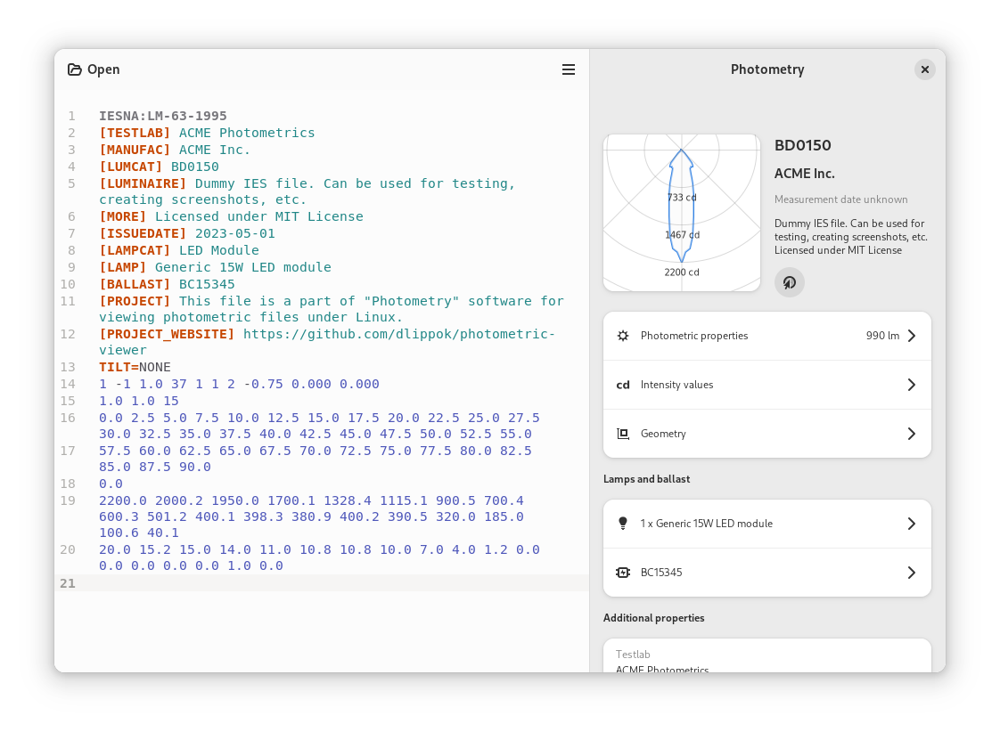

# Photometric Viewer

Application for viewing IES and EULUMDAT photometric files under Linux (Gnome/GTK).

<picture>
  <source srcset="docs/screenshots/Dark.png" media="(prefers-color-scheme: dark)">
  
</picture>

<a href='https://flathub.org/apps/io.github.dlippok.photometric-viewer'></a> 
<a href="https://snapcraft.io/photometric-viewer">
  
</a>


## Features

Photometic Viewer allows you to see following information from the opened photometric file:

- Light distribution curves of selected photometric files
- General information (Catalog Number, Manufacturer, Description, etc.)
- Photometric properties (Light Output Ration and Downward Flux Fraction)
- Lamps and ballast information
- Luminaire and luminous opening geometry information
- Additional properties (Test number, issue date, test laboratory, etc.)
- Intensity Values for selected C planes and gamma values
- Raw text source of photometric file

The application uses Libadwaita library for modern design and responsive layout. 


## Development

### Set up development environment

First, setup Python virtual environment. As the project requires pygobject packages to be present, the easiest way to setup it is to inherit it from your global site packages:

```shell
python3 -m venv venv --system-site-packages
```

Next, activate your virtual environment and install all missing dependencies:

```shell
. ./venv/bin/activate
```

### Running tests
```shell
python3 setup.py test
```

### Starting the application

```shell
python3 run.py
```

## Authors

- [Damian Lippok](https://github.com/dlippok)
