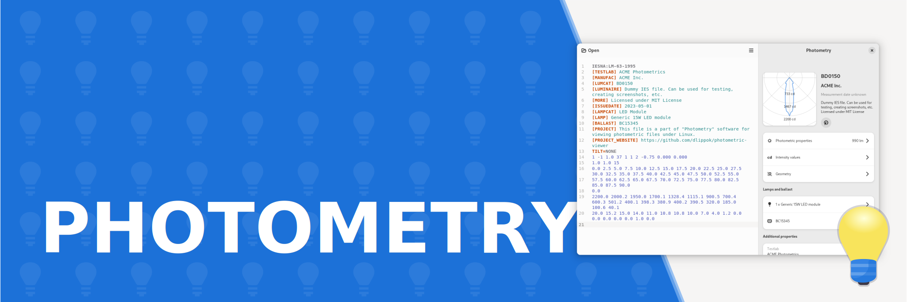

<picture>
  <source srcset="docs/images/banner-dark.svg" media="(prefers-color-scheme: dark)">
  
</picture>

# View photometric files under Linux.

Photometry allows viewing light distribution curves and metadata of IESNA and EULUMDAT photometric 
files which describe the light distribution of light sources like lamps and luminaires and
are used mostly for data transfer in the lighting industry and in 3D graphics.

## Features

- Light distribution curves of selected photometric files
- General information and photometric properties of the luminaire
- Intensity Values
- Lamps and ballast information
- Luminaire and luminous opening geometry information
- Additional properties (Test number, issue date, test laboratory, etc.)
- Source of photometric file with syntax highlighting

<a href='https://flathub.org/apps/io.github.dlippok.photometric-viewer'></a> 
<a href="https://snapcraft.io/photometric-viewer">
  
</a>


## Development

### Set up development environment

First, setup Python virtual environment. As the project requires pygobject packages to be present, the easiest way to setup it is to inherit it from your global site packages:

```shell
python3 -m venv venv --system-site-packages
```

Next, activate your virtual environment and install all missing dependencies:

```shell
. ./venv/bin/activate
```

### Running tests
```shell
make test
```

### Starting the application

```shell
make run
```

## Authors

- [Damian Lippok](https://github.com/dlippok)
